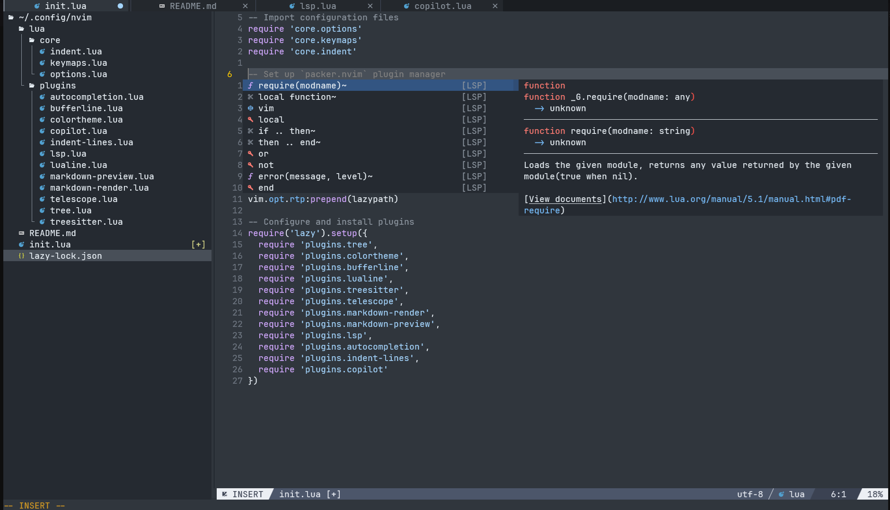

# My Neovim Configuration

Welcome to my Neovim setup! This configuration is built to enhance my coding workflow with an assortment of useful plugins, custom keybindings, and specific settings tailored to different programming languages.

Here’s how my Neovim setup looks in action:



## Requirements

- **Neovim** (0.8 or higher)
- **Node Package Manager**

## Install

```bash
$ cd ~/.config
$ git clone https://github.com/ruizsamuel/nvim
```

## Plugins

Here are the key plugins included in this setup:

- **tree-sitter**: Provides advanced syntax highlighting and code parsing.
- **bufferline**: A modern buffer line for managing open files.
- **lualine**: A sleek status line for better information display.
- **telescope**: A fuzzy finder for searching files, buffers, and more.
- **markdown-preview**: Live preview of Markdown files directly in Neovim (`:MarkdownPreview`).
- **lsp-config**: Language Server Protocol (LSP) configurations to bring IDE-like features to Neovim. This includes support for:
  - **Python** (via `pyright`)
  - **Java** (via `jdtls`)
  - **C/C++** (via `clangd`)
  - **Docker** (via `dockerls`)
  - **JavaScript/TypeScript** (via `ts_ls`)
  - **Angular** (via `angularls`)
  - **Lua** (via `lua_ls`)
  - **HTML/CSS** (via `html` and `cssls`)
  - **JSON** (via `jsonls`)
  - **YAML** (via `yamlls`)
- **autocompletion**: Auto-completion features with smart suggestions.
- **mini.indentscope**: Visual guides for indentation to improve code readability.
- **copilot**: GitHub Copilot for AI-powered code suggestions.
- **neotree**: A file explorer for easy navigation through your project.

---

## Key Mappings

Here's a table with my custom keybindings, grouped by category:

| **Category**           | **Key Mapping**             | **Action**                                      |
|------------------------|-----------------------------|------------------------------------------------|
| **General**            | `<C-s>`                     | Save file                                      |
| **Buffers**            | `<S-Tab>`                   | Switch to next buffer                          |
|                        | `<Tab>`                     | Switch to previous buffer                      |
|                        | `<C-q>`                     | Close buffer with confirmation                 |
| **Window Splitting**   | `<leader>ll`                | Vertical split                                 |
|                        | `<leader>jj`                | Horizontal split                               |
|                        | `<A-Up>`                    | Resize window up                               |
|                        | `<A-Down>`                  | Resize window down                             |
|                        | `<A-Right>`                 | Resize window right                            |
|                        | `<A-Left>`                  | Resize window left                             |
| **Window Switching**   | `<A-l>`                     | Switch to next window                          |
|                        | `<A-h>`                     | Switch to previous window                      |
| **Neotree**            | `<leader>ee`                | Open Neotree file explorer                     |
| **Indentation**        | `<`                         | Indent in visual mode                          |
|                        | `>`                         | Outdent in visual mode                         |
| **Clipboard**          | `p`                         | Paste without removing the last yank           |
| **Telescope**          | `<leader>sh`                | Search help tags                               |
|                        | `<leader>sk`                | Search keymaps                                 |
|                        | `<leader>sf`                | Search files                                   |
|                        | `<leader>ss`                | Search select Telescope                        |
|                        | `<leader>sw`                | Search current word                            |
|                        | `<leader>sg`                | Search by grep                                 |
|                        | `<leader>sd`                | Search diagnostics                             |
|                        | `<leader>sr`                | Search resume                                  |
|                        | `<leader>s.`                | Search recent files (repeat)                   |
|                        | `<leader><leader>`          | Find existing buffers                          |
|                        | `gd`                        | Jump to definition of word under cursor        |
|                        | `gr`                        | Find references for word under cursor          |
|                        | `gI`                        | Jump to implementation of word under cursor    |
|                        | `gD`                        | Go to declaration of word under cursor         |
|                        | `<leader>ds`                | Fuzzy find document symbols                    |
|                        | `<leader>ws`                | Fuzzy find workspace symbols                   |
|                        | `<leader>rn`                | Rename variable under cursor                   |
|                        | `<leader>ca`                | Execute code action                            |
| **Autocompletion**     | `<C-n>`                     | Select next completion item                    |
|                        | `<C-p>`                     | Select previous completion item                |
|                        | `<C-b>`                     | Scroll docs backward                           |
|                        | `<C-f>`                     | Scroll docs forward                            |
|                        | `<CR>`                      | Accept completion and auto-import if supported |
|                        | `<ESC>`                     | Close completion menu                          |
|                        | `<C-Space>`                 | Manually trigger completion                    |
| **Copilot**           | `<S-Tab>` (Insert) | Accept Copilot suggestion                      |
| **CopilotChat**        | `<leader>zc` (Normal)       | Chat with Copilot                             |
|                    | `<leader>ze` (Visual)       | Explain Code                                  |
|                    | `<leader>zr` (Visual)       | Review Code                                   |
|                    | `<leader>zf` (Visual)       | Fix Code Issues                               |
|                    | `<leader>zo` (Visual)       | Optimize Code                                 |
|                    | `<leader>zd` (Visual)       | Generate Docs                                 |
|                    | `<leader>zt` (Visual)       | Generate Tests                                |
|                    | `<leader>zm` (Normal)       | Generate Commit Message                       |
|                    | `<leader>zs` (Visual)       | Generate Commit for Selection                 |
